# rename-scientific-pdf

[](https://github.com/leiverkus/rename-scientific-pdf/releases/latest)
[](https://github.com/leiverkus/rename-scientific-pdf/actions/workflows/ci.yml)
[](LICENSE)
[](https://claude.ai/claude-code)
[](https://www.python.org/)
[](https://www.crossref.org/)
[](https://github.com/tesseract-ocr/tesseract)
[](#dependencies)

A skill for [Claude Code](https://claude.ai/claude-code) and [Claude Cowork](https://claude.ai) that renames scientific PDF files — journal articles, book chapters, preprints, and theses — into a clean, consistent schema:

```
Smith et al. - Attention Is All You Need - 2017.pdf
Jones & Lee - Deep Learning for Natural Lang - 2020.pdf
```

Works exactly like [Zotero's](https://www.zotero.org/) metadata resolver: it finds the DOI in the file, queries CrossRef or Semantic Scholar, and renames in place. Falls back gracefully to content-based search when no DOI is present.

<p align="center">
  
</p>

<sub><i>Illustrative animation — not a screen recording.</i></sub>

---

## Features

- **DOI-based lookup** via [CrossRef](https://www.crossref.org/) — authoritative metadata when a DOI is present
- **Content-based fallback** via CrossRef full-text search and [Semantic Scholar](https://www.semanticscholar.org/) for preprints and grey literature
- **OCR support** for image-only/scanned PDFs — your choice of [Tesseract](https://github.com/tesseract-ocr/tesseract) (local, fast) or Claude vision (more accurate for complex layouts)
- **Batch processing** — point it at a folder and it processes all PDFs inside, optionally recursing into subfolders
- **Naming schema**:
  - 1 author: `Smith`
  - 2 authors: `Smith & Jones`
  - 3+ authors: `Smith et al.`
  - Title truncated at ~40 characters at a word boundary
- **Collision handling** — appends `(1)`, `(2)` etc. if the target filename already exists
- **Year sanity check** — cross-checks API year against the first page to catch re-uploads with wrong dates

---

## Installation

### Claude Code / Claude Cowork

1. Download [`rename-scientific-pdf.skill`](https://github.com/leiverkus/rename-scientific-pdf/releases/latest/download/rename-scientific-pdf.skill) from the [latest release](https://github.com/leiverkus/rename-scientific-pdf/releases/latest)
2. Drag it into a Claude Code or Cowork chat — Claude will offer to install it

### Manual

Copy `SKILL.md` and `scripts/process_pdf.py` into your Claude skills directory.

---

## Dependencies

```bash
pip3 install -r requirements.txt          # or: pip3 install pymupdf pdf2image pytesseract

# System binaries — only needed for the Tesseract OCR path:
brew install tesseract poppler            # macOS
# sudo apt install tesseract-ocr poppler-utils   # Debian/Ubuntu
```

`pymupdf` (fitz) handles text extraction and is the only hard requirement. The Tesseract OCR path (for scanned / image-only PDFs) additionally needs `pdf2image` + `pytesseract` **and** two system binaries: `tesseract` and `poppler` (used by `pdf2image` to rasterize pages). Claude vision needs no additional setup.

### Non-English OCR

Tesseract defaults to English. For German, French, etc. install the language packs and set `TESSERACT_LANG`:

```bash
brew install tesseract-lang                # macOS — all language packs
export TESSERACT_LANG="eng+deu+fra"
```

### CrossRef etiquette (optional)

Set a contact email so CrossRef can reach you if your usage causes problems — it's [recommended etiquette](https://www.crossref.org/documentation/retrieve-metadata/rest-api/tips-for-using-the-crossref-rest-api/) and can yield more reliable service:

```bash
export CROSSREF_MAILTO="you@example.com"
```

---

## Usage

Just talk to Claude naturally:

```
Rename this paper: /Downloads/10.1038-s41586-021-03819-2.pdf
```

```
Go through ~/research/unread/ and rename everything with Zotero-style names.
```

```
Rename every PDF under ~/papers/ including all subfolders.
```

```
There's a scanned chapter at ~/Desktop/chapter5.pdf — figure out what it is and rename it.
```

On first run, Claude asks:
1. **OCR method** for image-only PDFs: Tesseract or Claude vision
2. **Uncertain metadata**: ask for confirmation, or skip and note in the summary

---

## Naming examples

| Before | After |
|--------|-------|
| `10.1038-s41586-021-03819-2.pdf` | `Jumper et al. - Highly Accurate Protein Struct - 2021.pdf` |
| `journal.pone.0293119.pdf` | `Pérez & García - Urban Heat Island Effects - 2023.pdf` |
| `2106.08295.pdf` | `Brown et al. - Language Models Are Few-Shot - 2020.pdf` |
| `scan001.pdf` *(scanned)* | `Smith - Ceramic Analysis in the Levant - 1998.pdf` |

---

## Changelog

See [CHANGELOG.md](CHANGELOG.md).

---

## License

MIT
